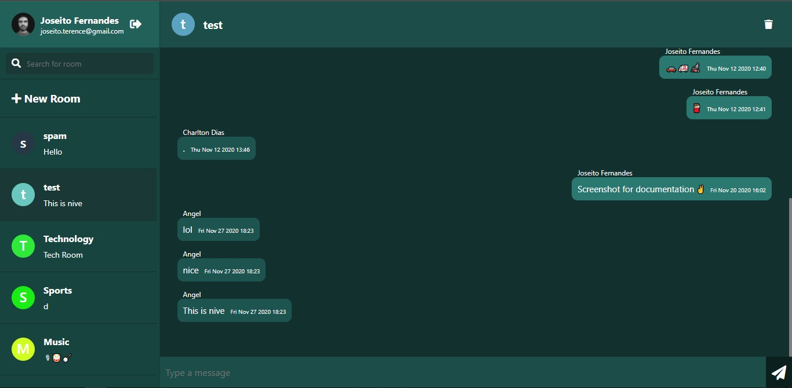
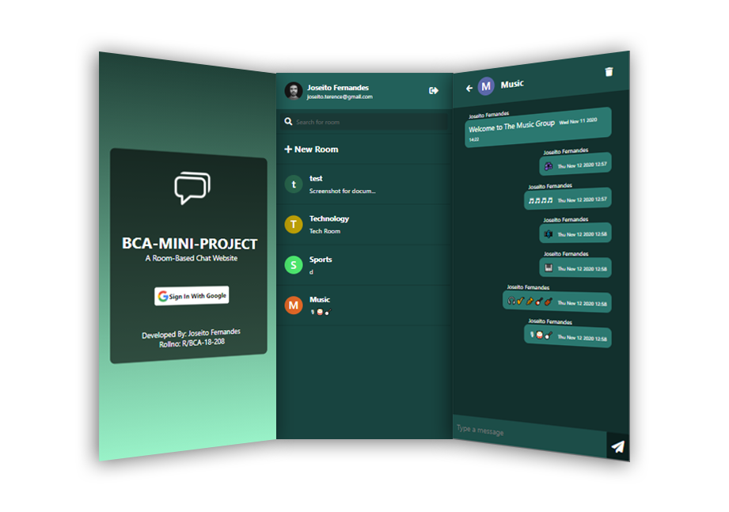

<p align="center">
    

  <h2 align="center">BCA-MINI-PROJECT</h2>

  <p align="center">
    A Room-based Chat web app build with ReactJS and Firebase.
    <br />
    Developed By: <strong>Joseito Fernandes</strong>
    <br />
    <br />
    <a href="https://myexpenses2.web.app/">Live Demo</a>
    .
    <a href="/rbca18208-Mini-Project-Documentation.pdf">View Official Docs</a>

  </p>
</p>
<br>

## 🚀 Live Demo
Check out the live demo @ [BCA-MINI-PROJECT](https://bca-mini-project.web.app/).

## 🧐 About The Project
A Room-based Chat website. It includes public rooms where different people can chat, have discussions about a common interest or a single a topic.
<br />
This project was developed for a college assignment.
<br />
The official documentation: [View Docs](/rbca18208-Mini-Project-Documentation.pdf)





## 💻 Built With

Following are the major frameworks and libraries used to build this project.
* [ReactJS](https://reactjs.org/)
* [Firebase](https://firebase.google.com/)

## 🛠️ Getting Started

To get a local copy up and running follow these simple example steps.

### Installation

1. Clone the repo
   ```sh
   git clone https://github.com/joseito-terence/bca-mini-project.git
   ```
2. Install NPM packages
   ```sh
   npm install
   ```
3. Start NPM server.
   ```sh
   npm start
   ```


